# Design Patterns

A collection of Java implementations of design patterns

## 1) Strategy

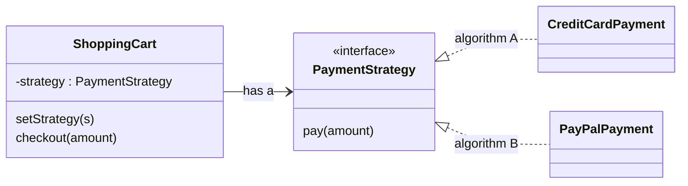

## 2) Observer

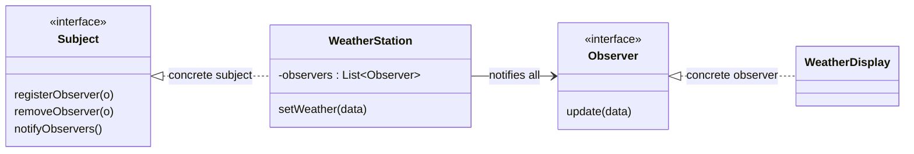

## 3) Decorator

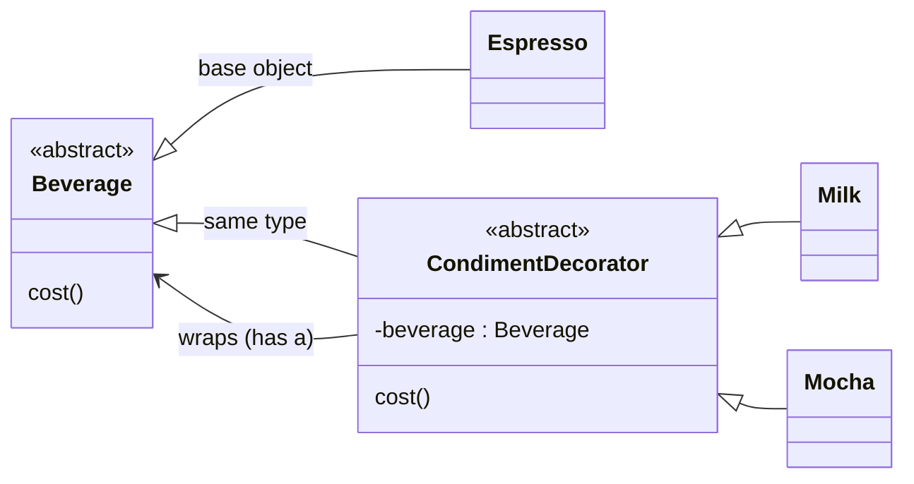

## 4) Simple Factory

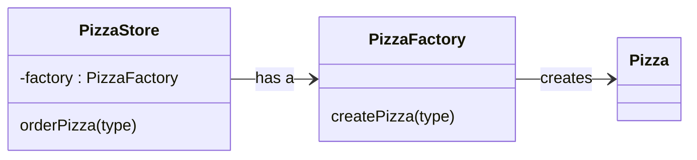

## 5) Factory Method

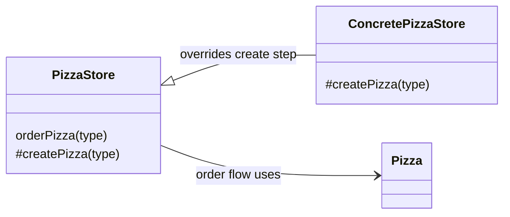

## 6) Abstract Factory

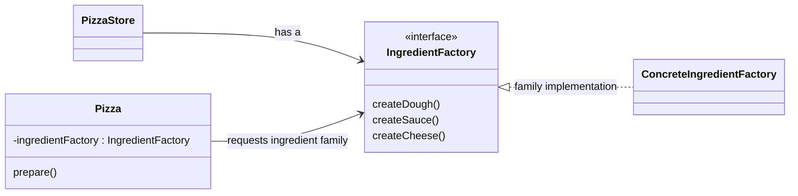

## 7) Singleton

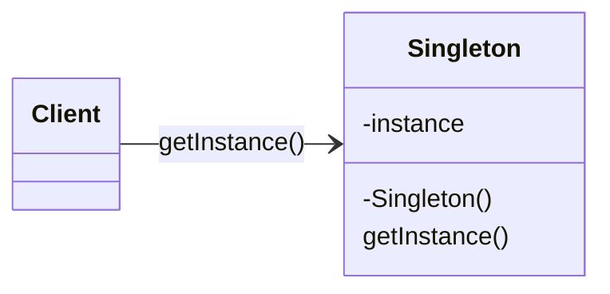

## 8) Command

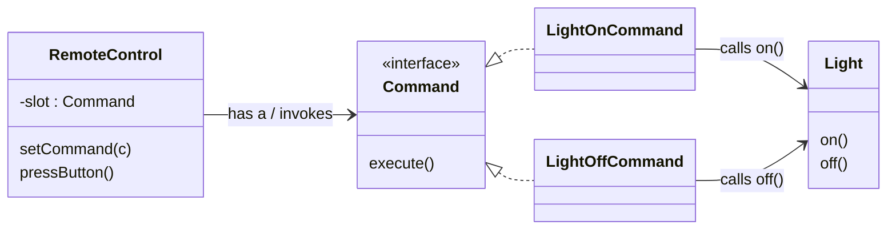

## 9) Adapter

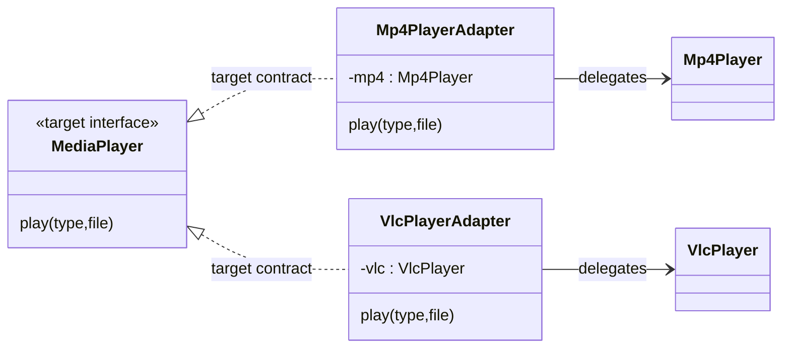

## 10) Facade

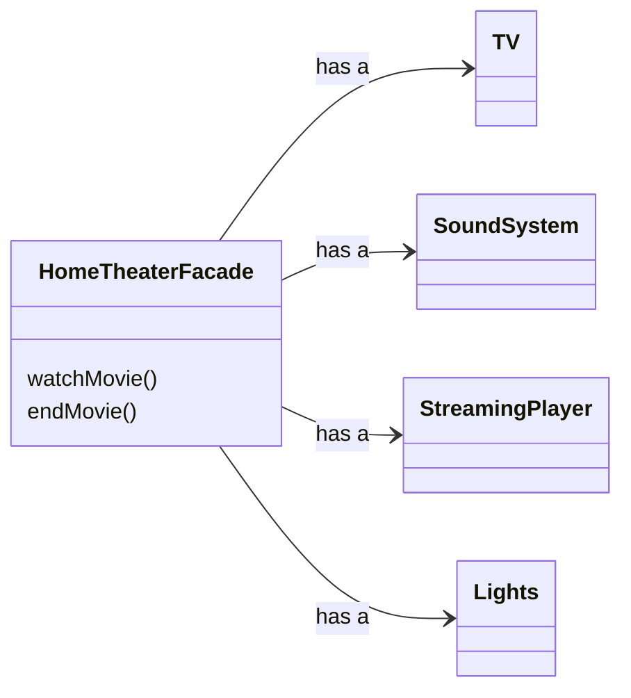

## 11) Template Method

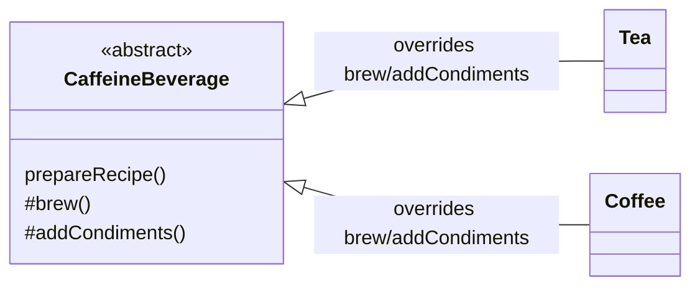

## Notation Guide

- `#` means `protected`
- `-` means `private`
- no prefix means `public`

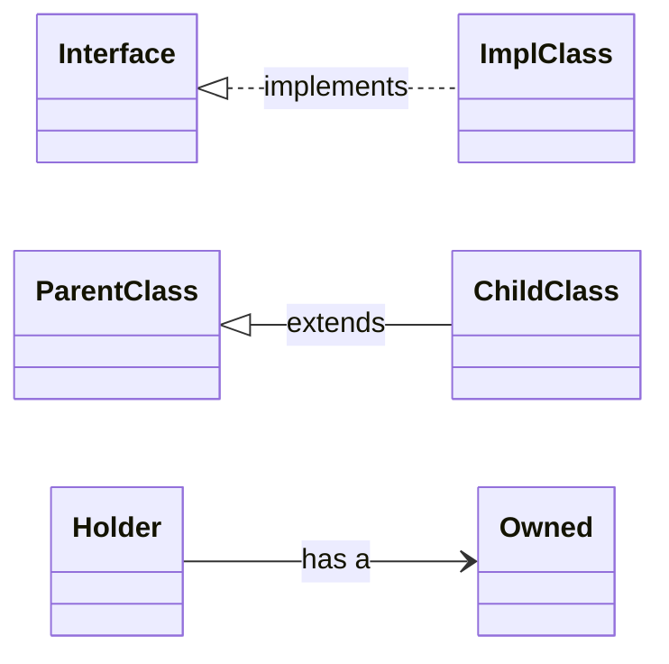
